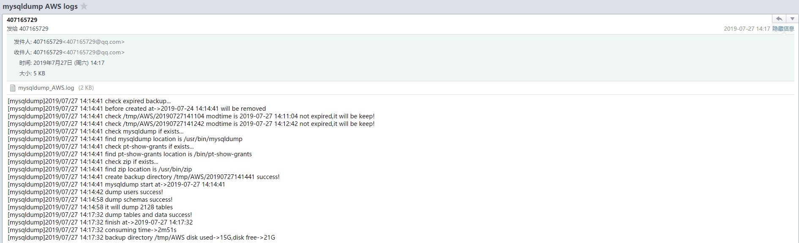

### 产生背景
主要是解决快速恢复MySQL里的某张表的需求，很多情况下恢复数据的需求都是只要求恢复某一张表的数据，如果利用物理备份还原整个实例在导出某张表，操作繁琐，消耗时间太长，做不到快速恢复，对于生产业务来说，数据恢复时间越短，对业务的影响就越小，所以就考虑到逻辑备份每张表

### 主要功能
- 将每个表导出为单个文件并且压缩，最后导出的格式为dbname.tablename.sql.zip，需要恢复哪个表的数据，直接使用unizp命令(需要提前安装)解压该压缩文件就可以
- 将每个库的表结构、存储过程、自定义函数、触发器、事件导出格式为dbname.schemas.sql.zip，一个库对应一个压缩文件
- 将数据里的用户导出为user.sql.zip，如果需要还原某个用户，直接运行对应的SQL就可以
- 支持将备份日志发送给相关人员(支持多个人员接收邮件)
- 支持备份保留天数，自动清理过期的备份
- 备份日志位于/tmp/mysqldump_业务名称.log
- 备份后会记录备份目录已使用的磁盘空间容量和可使用的磁盘空间容量
- 记录备份耗时
- 去掉了drop table关键词，防止删库跑路事件

### 运行依赖
请提前安装
```
# 1.创建MySQL备份用户并授权->备份用到的权限
GRANT SELECT,SUPER,LOCK TABLES,REPLICATION CLIENT,EVENT,SHOW VIEW,TRIGGER ON *.* TO 'backup_user'@'%' identified by 'yourpassword';
# 2.安装zip工具->压缩导出的对象
yum install zip -y
# 3.安装pt-show-grants工具->导出权限使用
# 安装依赖
yum install perl-DBI perl-DBD-MySQL perl-Time-HiRes perl-IO-Socket-SSL perl-Digest-MD5 perl-TermReadKey -y
# centos 7
wget https://www.percona.com/downloads/percona-toolkit/3.0.13/binary/redhat/7/x86_64/percona-toolkit-3.0.13-1.el7.x86_64.rpm
rpm -ivh percona-toolkit-3.0.13-1.el7.x86_64.rpm
# centos 6
wget https://www.percona.com/downloads/percona-toolkit/3.0.13/binary/redhat/6/x86_64/percona-toolkit-3.0.13-1.el6.x86_64.rpm
rpm -ivh percona-toolkit-3.0.13-1.el6.x86_64.rpm
```

### 编译
需要有go环境，[go安装参考](https://aikbuk.com/2018/10/go%E5%AE%89%E8%A3%85/)
```bash
git clone https://github.com/wangtuo1224/mysql_logical_backup.git
cd mysql_logical_backup
# 编译可执行文件到当前目录
go build
# 将可执行文件安装到GOPATH
go install
```

### 运行
示例
```bash
# ./mysql_logical_backup --help
usage: mysql_logical_backup [<flags>]

Flags:
  -h, --help                    Show context-sensitive help (also try --help-long and --help-man).
      --backup.path="/tmp"      Path Under Which To Store Backup Files. // 配置备份基础目录，该路径为绝对路径，默认/tmp
      --backup.flag="AWS"       Backup Flag. // 指定业务名称
      通过以上两个参数可以确定最终备份文件所在如下目录
      /tmp/AWS/20190727162202->20190727162202目录为根据当前备份时间自动创建
      --mysqldumpbin.dir="/usr/bin/mysqldump"  
                                Where is mysqldump. // 指定mysqldump所在路径，默认/usr/bin/mysqldump，为了严谨，请使用对应版本的mysqldump工具
      --ptbin.dir="/bin/pt-show-grants"  
                                Where is pt-show-grants. // 指定pt-show-grants所在路径 ，默认/bin/pt-show-grants
      --zip.dir="/usr/bin/zip"  Where is zip. // 指定zip所在路径，默认/usr/bin/zip
      --mysql.keepdays=3        MySQL Backup Keep Days. // 配置备份保留天数，默认3天
      --mysql.host="127.0.0.1"  MySQL Server Host. // 配置mysql服务器IP，默认127.0.0.1
      --mysql.port=3306         MySQL Server Port. // 配置mysql端口号，默认3306
      --mysql.user="backup_user"  
                                MySQL Server User. // mysql备份账号，默认backup_user
      --mysql.password=""       MySQL Server Password. // mysql备份账号密码
      --email.recivers=""       Send email to users. // 邮件接收人，多个以英文逗号分隔
      --email.serverHost=""     Email server host. // 发件服务器主机
      --email.serverPort=0      Email server port. // 发件服务器端口
      --email.from=""           Email from user. // 邮件发送者账号
      --email.password=""       Email from user's password. // 邮件发送者密码或授权码
      --version                 Show application version. // 显示版本

# 使用举例
./mysql_logical_backup --backup.path=/tmp --backup.flag='AWS' --mysqldumpbin.dir=/usr/bin/mysqldump --ptbin.dir=/bin/pt-show-grants --zip.dir=/usr/bin/zip --mysql.keepdays=3 --mysql.host=127.0.0.1 --mysql.port=3306 --mysql.user=backup_user --mysql.password='yourpassword' --email.recivers=407165729@qq.com --email.serverHost='smtp.qq.com' --email.serverPort=587 --email.from=407165729@qq.com --email.password='yourpassword'
```
注意:  
如果以上参数不指定都会使用--help显示的默认参数 



### 导出确认
```bash
-- 查看每个数据库下的表数量
select table_schema,count(*) from information_schema.tables where table_schema not in ('information_schema','performance_schema','mysql','sys') group by table_schema;

-- 查看每个数据库下的存储过程和自定义函数数量
select routine_schema,routine_type,count(*) from information_schema.routines where routine_schema not in ('information_schema','performance_schema','mysql','sys') group by routine_schema,routine_type;

-- 查看每个数据库下的视图数量
select table_schema,count(*) from information_schema.views where table_schema not in ('information_schema','performance_schema','mysql','sys') group by table_schema;

-- 查看每个数据库下的触发器数量
select trigger_schema,count(*) from information_schema.triggers where trigger_schema not in ('information_schema','performance_schema','mysql','sys') group by trigger_schema;

-- 查看每个数据库下的事件数量
select event_schema,count(*) from information_schema.events where event_schema not in ('information_schema','performance_schema','mysql','sys') group by event_schema;
```

### 注意事项
MySQL视图会当做一个表，使用show tables的时候会显示，使用mysqldump导出视图需要show view权限
如果不给trigger权限，则触发器无法导出，并且不会报错
